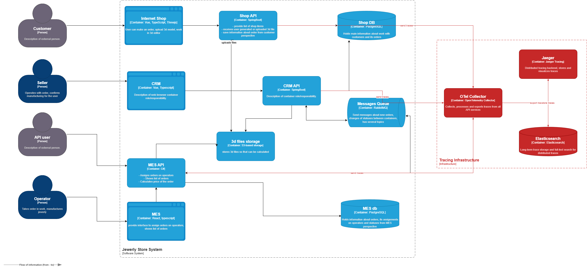

# Архитектурное решение по трейсингу

## Мотивация

Сейчас команда не может ответить на элементарный вопрос: «Где сейчас находится заказ?». Заказы зависают в неопределённом состоянии, и нет никакого инструмента, который показал бы, на каком именно шаге это произошло. Разработчикам приходится собирать картину по кусочкам: смотреть логи в разных местах (если они вообще есть), пытаться воспроизвести ситуацию вручную.

**Трейсинг решает эту проблему** - он позволяет видеть полный путь каждого заказа через все сервисы и очередь, с таймингами каждого шага.

Бизнес-метрики и технические метрики, на которые повлияет внедрение трейсинга:

1. **MTTR (Mean Time to Resolve)** - среднее время устранения инцидента. Сейчас часы/дни. После внедрения трейсинга - минуты: по trace ID сразу видно, где завис заказ.
2. **Количество эскалированных жалоб клиентов** - снизится, потому что поддержка сможет быстро ответить клиенту, где находится его заказ, не привлекая разработчиков.
3. **Время на аналитику** - сокращается в разы. Не нужно вручную коррелировать логи из трёх систем.
4. **Конверсия заказов** (бизнес) - если заказы перестают теряться и команда быстро реагирует на зависания, клиенты получают свои изделия в срок. Это удержание клиентов и репутация.
5. **Retention крупных B2B-партнёров** - партнёры, которые потеряли заказы, ушли. После внедрения трейсинга можно не только быстро решать проблемы, но и предоставлять отчёты о прохождении заказов - это конкурентное преимущество при B2B-продажах.

---

## Системы и места, которые нужно покрыть трейсингом

Для понимания того, где заказ может сломаться, я прошёлся по всему пути заказа:

### Полный путь заказа (номинальный сценарий):

1. Customer → **Internet Shop (Vue)** → создание заказа
2. **Shop API (Spring Boot)** → сохранение заказа в Shop DB, статус INITIATED
3. **Shop API** → загрузка 3D-файла в S3 storage, статус FILE_UPLOADED
4. Customer нажимает «Сделать заказ» → **Shop API** → статус SUBMITTED
5. **Shop API** → публикация сообщения в RabbitMQ
6. **RabbitMQ** → **MES API** получает сообщение → расчёт стоимости
7. **MES API** → статус PRICE_CALCULATED → публикация в RabbitMQ
8. **RabbitMQ** → **CRM API** получает сообщение
9. **CRM API** → статус MANUFACTURING_APPROVED (продавец подтверждает)
10. **CRM API** → публикует сообщение в RabbitMQ
11. **MES API** получает → оператор берёт в работу → MANUFACTURING_STARTED
12. → MANUFACTURING_COMPLETED → PACKAGING → SHIPPED
13. **CRM API** → CLOSED

### Точки, где заказ может «сломаться»:

- **Shop API → RabbitMQ**: сообщение не отправлено или отправлено, но потеряно
- **RabbitMQ → MES API**: сообщение не доставлено, не обработано, попало в DLQ
- **MES API**: расчёт стоимости завис или завершился ошибкой без публикации результата
- **MES API → RabbitMQ**: сообщение о PRICE_CALCULATED не отправлено
- **RabbitMQ → CRM API**: сообщение не доставлено
- **CRM API → RabbitMQ**: подтверждение заказа не опубликовано
- **MES API (оператор)**: оператор взял заказ, но статус не обновился (баг в MES)

### Какие системы нужно покрыть трейсингом (выделены на схеме):

**Shop API** - начало пути заказа, публикация в очередь  
**MES API** - расчёт стоимости, обработка сообщений из очереди, работа операторов  
**CRM API** - обработка событий из очереди, подтверждение заказов  
**RabbitMQ** - передача сообщений между сервисами (через header propagation)  

MES фронтенд и CRM фронтенд в трейсинг не включаем - действия пользователя в браузере лучше трекать отдельным инструментом (Real User Monitoring). Internet Shop (Vue) - аналогично.

### Данные, которые должны попадать в трейсинг:

- `trace_id` - единый идентификатор всего пути заказа
- `span_id` - идентификатор конкретной операции
- `order_id` - идентификатор заказа (обязательно, как бизнес-атрибут)
- `service_name` - имя сервиса
- `operation_name` - название операции (например, `order.submit`, `price.calculate`, `order.approve`)
- `timestamp_start` / `timestamp_end` - время начала и конца операции
- `duration_ms` - длительность
- `status` - успех/ошибка
- `error_message` - текст ошибки (если есть), без чувствительных данных
- `order_status` - статус заказа на момент события (бизнес-атрибут)
- Для RabbitMQ: `queue_name`, `exchange_name`
- **Не включаем**: персональные данные клиента (ФИО, email, адрес), платёжные данные, содержимое 3D-файла

---

## Предлагаемое решение

### Выбор технологии

Я выбираю **OpenTelemetry** как стандарт инструментирования + **Jaeger** как backend для хранения и визуализации трейсов.

Почему OpenTelemetry:
- Вендор-нейтральный стандарт, поддерживается всеми крупными облаками и инструментами
- Есть SDK для Java (Spring Boot), C# и JavaScript
- Поддерживает propagation через HTTP headers и AMQP headers (RabbitMQ)
- Если в будущем захотим сменить backend (Jaeger → Zipkin → Tempo) - менять инструментирование не нужно

Почему Jaeger:
- Хорошо интегрируется с OpenTelemetry Collector
- Удобный UI для просмотра трейсов по trace ID или order_id
- Open source, нет лицензионных ограничений
- Широко известен команде по публичным материалам

### Компоненты

1. **OpenTelemetry SDK** - встраивается в каждый сервис:
   - Shop API (Java/Spring Boot): `opentelemetry-spring-boot-starter`
   - CRM API (Java/Spring Boot): `opentelemetry-spring-boot-starter`
   - MES API (C#): `OpenTelemetry.Extensions.Hosting` + `OpenTelemetry.Instrumentation.AspNetCore`

2. **Propagation через RabbitMQ** - при публикации сообщения добавляем trace context в AMQP headers (`traceparent`, `tracestate`). При получении сообщения - извлекаем и продолжаем span.
   - Для Java: `opentelemetry-instrumentation-rabbitmq` (автоматическая инструментация)
   - Для C#: ручная или через `OpenTelemetry.Instrumentation.MassTransit` если используется MassTransit

3. **OpenTelemetry Collector** - агрегирует трейсы от всех сервисов, фильтрует, пробрасывает в Jaeger. Разворачивается как отдельный сервис.

4. **Jaeger** - хранение и визуализация трейсов. В качестве backend для хранения используем Elasticsearch (тот же, что для логов - снижаем операционные расходы). Разворачивается как EC2-инстанс или контейнер.

5. **business_key (order_id) как атрибут** - при создании заказа `order_id` прокидывается во все spans как кастомный атрибут. Это позволяет искать все события конкретного заказа в Jaeger UI.

### Схема взаимодействия новых компонентов

Новые компоненты (выделены красным на диаграмме):

```
Shop API ──────────────────────────────────┐
         [OTel SDK, propagates via HTTP]   │
                                           ▼
         ─── AMQP message + trace header ──► RabbitMQ
                                           │
MES API ◄──────────────────────────────────┘
[OTel SDK, extracts trace from AMQP header]│
         ─── AMQP message + trace header ──► RabbitMQ
                                           │
CRM API ◄──────────────────────────────────┘
[OTel SDK, extracts trace from AMQP header]│
                                           │
Shop API ─────► OTel Collector ────────────┤
MES API  ─────► OTel Collector ────────────┼──► Jaeger
CRM API  ─────► OTel Collector ────────────┘         [Elasticsearch backend]
```

Ссылка на обновлённую диаграмму C4 с новыми компонентами (красным): [jewerly_c4_model_with_tracing.drawio](../Задание/jewerly_c4_model.drawio)


---

## Компромиссы

### Где трейсинг затруднён или невозможен

**MES - проприетарное решение, купленное с кодом**
Компания купила MES вместе с исходным кодом. Внедрение OTel SDK требует доработки кода - это возможно, но требует времени C#-разработчика и тщательного тестирования. Если код MES плохо структурирован или устарел, это может быть трудоёмко.

**Транспортный агент (доставка)**
CLOSED-статус устанавливается «после получения сообщения от транспортной компании». Если транспортная компания использует свою систему без поддержки OpenTelemetry - мы не сможем включить этот шаг в наш трейс. Граница трейсинга - SHIPPED.

**Расчёт стоимости (2–30 минут)**
Jaeger хранит трейсы с ограниченным TTL. Если время жизни трейсов в Jaeger меньше 30 минут - мы рискуем потерять незакрытые spans. Нужно убедиться, что TTL трейсов достаточный (например, 7 дней), или явно финализировать span при получении результата расчёта.

**Высокая стоимость при 100% sampling**
При росте нагрузки трейсить каждый запрос дорого (хранение, CPU). На начальном этапе - 100% sampling оправдан, так как нагрузка небольшая. В будущем потребуется перейти на tail-based sampling (сохранять трейсы только для медленных или ошибочных запросов).

**Internet Shop и браузерный фронтенд**
Vue-фронтенд частично можно инструментировать через OpenTelemetry для браузера, но это требует отдельной работы и не является приоритетом. Без фронтенда мы теряем видимость «до Shop API», но это некритично - основные проблемы происходят глубже.

---

## Аспекты безопасности

**Доступ к Jaeger UI**
Jaeger UI не должен быть доступен из интернета. Разворачиваем в приватной сети Yandex Cloud, доступ только через VPN или внутреннюю сеть компании. Аутентификация в Jaeger UI - через SSO (если у компании есть корпоративный IdP) или nginx basic auth как временное решение.

**Роли и права доступа**
- Разработчики и поддержка - полный доступ на чтение трейсов
- DevOps - полный доступ (чтение + управление конфигурацией)
- Операторы и продавцы - нет доступа к трейсинг-инфраструктуре

**Чувствительные данные в трейсах**
В spans запрещено передавать: ФИО, email, адрес, номер телефона клиента, платёжные данные.

**Канал от сервисов до OTel Collector**
Передача трейсов от сервисов к OTel Collector - только внутри приватной сети. OTLP-экспортёр настраивается на внутренний адрес Collector, не на публичный.

**Elasticsearch для трейсов**
Elasticsearch закрыт от внешней сети. Доступ только у Jaeger и DevOps. Используем отдельный индекс для трейсов с ограниченным TTL (например, 30 дней), чтобы контролировать объём данных.

---

## Дополнительное задание: автоматический мониторинг заказов из данных трейсинга

На основе трейсов можно построить автоматический контроль прохождения заказов.

### Идея

Каждый заказ имеет предсказуемое время прохождения каждого этапа:
- Shop API → MES API (через очередь): должно занять несколько секунд
- Расчёт стоимости в MES: от 2 до 30 минут
- CRM подтверждение: зависит от менеджера, но при задержке > X часов - стоит алертить

Если заказ не прошёл определённый этап за ожидаемое время - это аномалия.

### Реализация

1. **Jaeger + аналитический слой**: OpenTelemetry Collector экспортирует данные не только в Jaeger, но и в time-series базу (Prometheus или ClickHouse). Там считаем агрегаты: количество незакрытых spans по типу операции старше порогового времени.

2. **Правила алертинга в Grafana**:
   - Span `price.calculate` открыт более 35 минут → алерт (что-то пошло не так при расчёте)
   - Span `order.submit → price.calculate` не появился в течение 5 минут → потенциально потеряно сообщение в очереди
   - Span `manufacturing.approved` не появился в течение 2 часов после `price.calculated` → менеджер не подтвердил заказ (нужно напомнить)

3. **Дашборд «Здоровье заказов»** в Grafana: показывает количество заказов по статусам и сколько из них «застряло» на каждом этапе дольше нормы.
